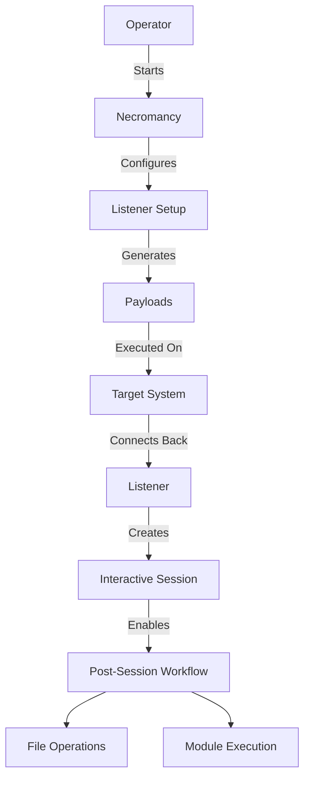
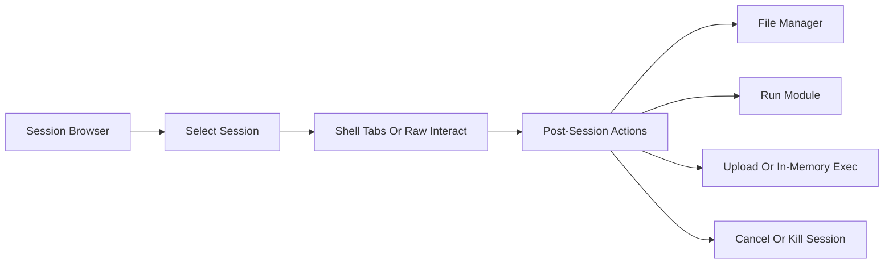
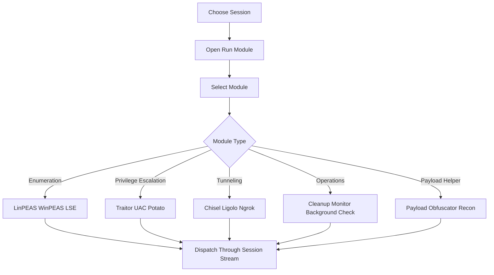
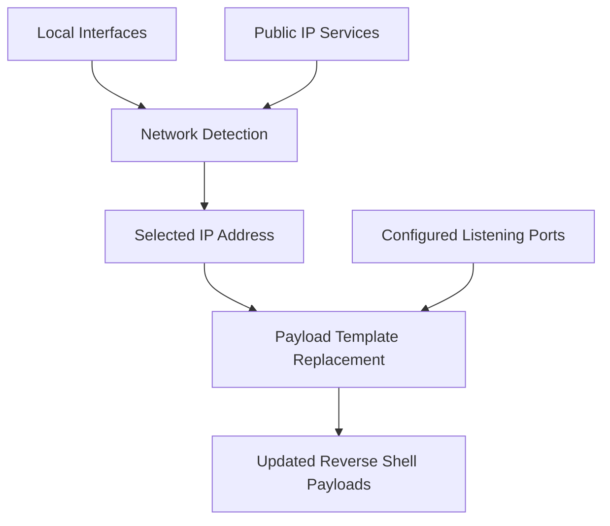

# Necromancy

<p align="center">
  
</p>

[](https://golang.org/)
[](LICENSE)
[](https://github.com/Aryma-f4/necromancy/releases/latest)

Necromancy is a TUI-first reverse shell manager written in Go. It combines multi-session handling, payload generation, file transfer helpers, tabbed shell workspaces, and a built-in module catalog for post-session operations.

> Warning
> Use this project only in environments you own or are explicitly authorized to test.

## Overview

Necromancy is designed for operators who want a more structured alternative to plain `nc` listeners. The application focuses on three things:

- managing multiple shell sessions from one place,
- reducing friction after a shell lands, and
- keeping common operator tasks available inside the terminal UI.

The codebase includes:

- reverse-shell listeners and bind-shell connections,
- a TUI dashboard built with `tview`,
- session logging and tabbed shell workspaces,
- payload preview and clipboard copy support,
- a lightweight HTTP file server,
- a built-in module registry for post-session helpers.

## Highlights

### Core runtime

- Multi-listener support with comma-separated ports.
- Reverse-shell and bind-shell workflows.
- Automatic PTY upgrade attempts for non-Windows shells.
- Session logging under `logs/` unless disabled.
- Headless mode for VPS, `tmux`, `nohup`, or CI-style environments.

### Operator workflow

- Dashboard pages for sessions, payloads, modules, network info, and interfaces.
- Raw interactive shell mode and TUI-based tabbed shell workspace.
- Clipboard-friendly payload preview with automatic IP substitution.
- Session actions for upload, in-memory execution, module dispatch, and command cancel.
- Built-in update checker and GitHub release downloader.

### Module coverage

- Enumeration helpers such as `peass_auto`, `linpeas`, `winpeas`, and `lse`.
- Privilege-escalation helpers such as `traitor`, `uac`, and `potato`.
- Tunneling helpers such as `chisel`, `ligolo`, and `ngrok`.
- Operations and monitoring helpers such as `cleanup`, `process_monitor`, and `background_checker`.
- Additional workflow helpers including `payload_obfuscator`, `enhanced_preflight_recon`, `redsun`, and `bluehammer`.

> Note
> Some modules are full command dispatchers, while others are helper or placeholder workflows that print guidance or bootstrap commands. See `MODULES.md` for the current catalog.

## Visual Workflows

### Basic Reverse Shell Workflow



### Session Management Flow



### Module Execution Flow



### Network And Payload Update Flow



## Quick Start

### 1. Download a release

```bash
# Linux amd64
curl -LO https://github.com/Aryma-f4/necromancy/releases/latest/download/necromancy-linux-amd64
chmod +x necromancy-linux-amd64
./necromancy-linux-amd64
```

### 2. Install with Go

```bash
go install github.com/Aryma-f4/necromancy@latest
```

### 3. Build from source

```bash
git clone https://github.com/Aryma-f4/necromancy.git
cd necromancy
go build -o necromancy .
./necromancy
```

### 4. Typical startup patterns

```bash
# Default listener on 4444
./necromancy

# Listen on multiple ports
./necromancy -p 4444,4445,4446

# Serve a directory over HTTP
./necromancy -p 4444 -s ./payloads -w 8000

# Connect to a bind shell
./necromancy -c target.example -p 4444

# Run without the TUI
./necromancy --headless
```

## Command-Line Reference

Necromancy currently exposes a mix of short flags and a few long-form utility flags. The core listener options are short-form in the current implementation.

| Flag | Type | Default | Description |
| --- | --- | --- | --- |
| `-p` | string | `4444` | Comma-separated listening ports |
| `-s` | string | empty | Serve a directory through the built-in HTTP server |
| `-i` | string | `0.0.0.0` | Local interface or IP to bind |
| `-c` | string | empty | Connect to a bind shell host instead of listening |
| `-m` | int | `0` | Maintain at least `N` sessions per target |
| `-L` | bool | `false` | Disable per-session log files |
| `-U` | bool | `false` | Disable automatic PTY upgrade |
| `-O` | bool | `false` | Enable OSCP-safe mode flag |
| `-w` | int | `8000` | HTTP file-server port |
| `-S` | bool | `false` | Accept only the first created session |
| `-C` | bool | `false` | Do not auto-attach on new sessions |
| `--prefix` | string | empty | URL prefix for the HTTP file server |
| `-a`, `--payloads` | bool | `false` | Print sample reverse-shell payloads and exit |
| `-l`, `--interfaces` | bool | `false` | Print local network interfaces and exit |
| `-v`, `--version` | bool | `false` | Print version and exit |
| `--headless` | bool | `false` | Run without the TUI |
| `--check-update` | bool | `false` | Check GitHub Releases for a newer version |
| `--update` | bool | `false` | Download and replace the current binary with the latest release |

### Handy one-liners

```bash
# Print payload suggestions using the current IP detection logic
./necromancy --payloads -p 8080

# List local interfaces
./necromancy --interfaces

# Check whether a new release exists
./necromancy --check-update
```

## TUI Workflow

Necromancy is primarily a menu-driven terminal UI, not a typed command console. Most actions are selected from panels.

### Main dashboard

The main menu exposes:

- `Sessions`
- `Payloads`
- `Modules`
- `Network Info`
- `Interfaces`
- `Exit`

### Session actions

Selecting a session opens the action menu:

- `Shell Tabs`
- `Raw Interact`
- `File Manager`
- `Cancel Commands`
- `Run Module`
- `Upload File`
- `In-Memory Exec`
- `Port Forwarding`
- `Kill`

### Shell tabs

The tabbed shell workspace keeps multiple local views for the same remote stream.

| Key | Action |
| --- | --- |
| `Ctrl+N` | Create a new tab |
| `Ctrl+W` | Close the active tab |
| `Tab` / `Shift+Tab` | Switch tabs |
| `Up` / `Down` | Browse local command history |
| `Esc` | Return to session actions |

### Payload page

The payload page:

- renders payloads using the detected IP,
- prefers a public IP when available,
- supports `Enter` or `c` to copy the selected payload,
- supports `r` to refresh network information.

## File Transfer And Logging

- Starting Necromancy with `-s` enables the built-in HTTP file server.
- Per-session logs are written to `logs/session_<id>.log` unless `-L` is used.
- General runtime logs are written to `necromancy-go.log`.
- Session upload and in-memory execution are available from the session action menu.

## Module System

Modules are dispatched after a shell is already established. The full catalog lives in [MODULES.md](MODULES.md).

Current built-in module keys include:

- `peass_auto`, `linpeas`, `winpeas`, `lse`
- `traitor`, `uac`, `potato`
- `chisel`, `ligolo`, `ngrok`
- `meterpreter`, `cleanup`, `panix`, `linux_procmemdump`
- `filemanager`, `redsun`, `bluehammer`
- `payload_obfuscator`, `enhanced_preflight_recon`
- `process_monitor`, `background_checker`

## Documentation Map

- [Documentation.md](Documentation.md): complete product documentation
- [MODULES.md](MODULES.md): built-in module catalog
- [QUICK_REFERENCE.md](QUICK_REFERENCE.md): short operational cheatsheet
- [CONFIGURATION.md](CONFIGURATION.md): configuration examples
- [AGENTS.md](AGENTS.md): project architecture and AI-agent notes
- [CONTRIBUTING.md](CONTRIBUTING.md): contribution guide
- [SECURITY.md](SECURITY.md): security reporting policy

## Project Layout

```text
necromancy/
├── core/       # sessions, networking, terminal helpers, config
├── modules/    # built-in post-session helpers and file-manager logic
├── pty/        # PTY upgrade logic
├── server/     # HTTP file server
├── ui/         # tview-based interface and shell tabs
├── updater/    # release checking and self-update logic
├── utils/      # formatting and network helpers
└── main.go     # application entry point
```

## Safety Notes

- Only use Necromancy for authorized testing.
- Review generated payloads before using them.
- Treat helper modules as automation aids, not guarantees.
- Validate OS-specific behavior on lab targets before production assessments.

## License

This project is released under the [MIT License](LICENSE).

---

**Version:** `v1.5.1`
**Repository:** <https://github.com/Aryma-f4/necromancy>
