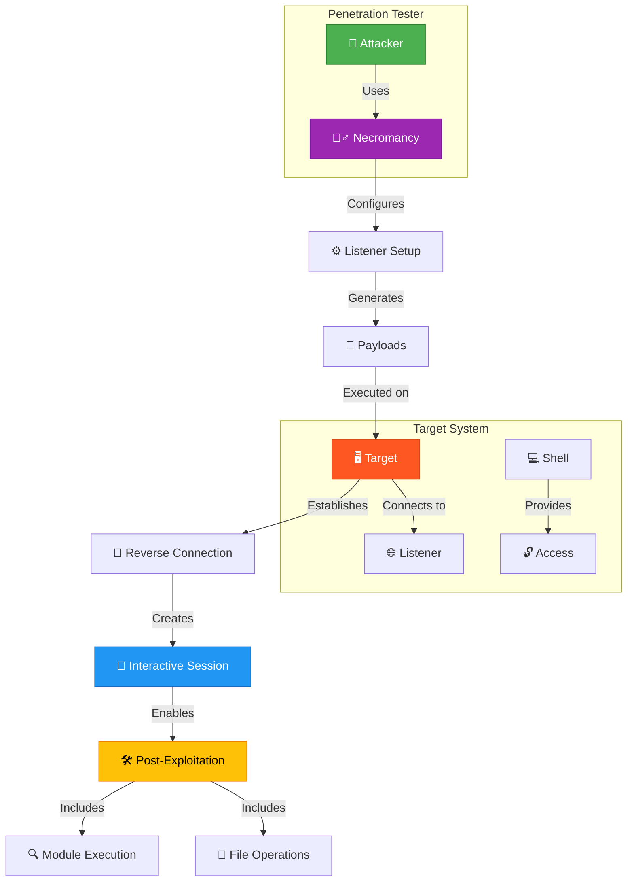
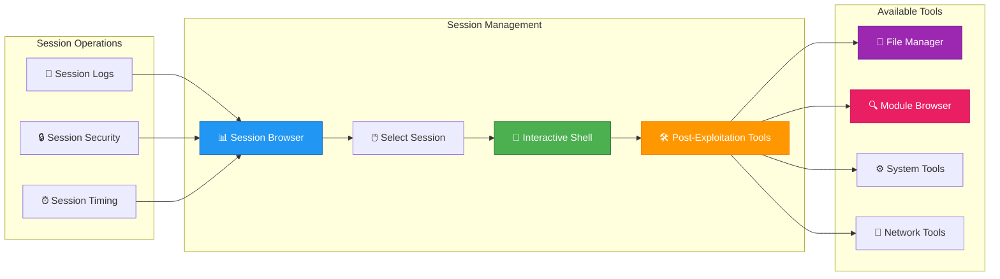
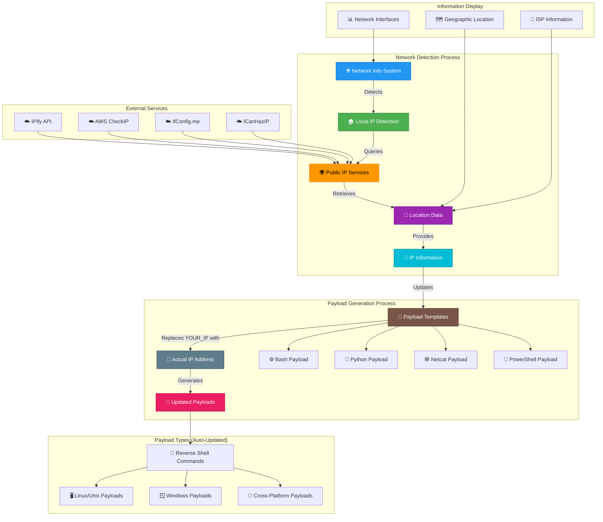

# 🧙‍♂️ Necromancy - Advanced Post-Exploitation Shell Manager

<p align="center">
  
</p>

[](https://golang.org/)
[](LICENSE)
[](https://github.com/Aryma-f4/necromancy/releases/latest)

**Necromancy** is a powerful shell handler built as a modern netcat replacement for RCE exploitation, aiming to simplify, accelerate, and optimize post-exploitation workflows.

## 🚀 Quick Navigation

<div align="center">

### 📖 [Installation Guide](#quick-start) | 🎯 [Usage Examples](#usage-examples) | 📚 [Documentation](#documentation)

### 🔧 [Features](#features) | ⚡ [Quick Start](#quick-start) | 🛠️ [Command Line Options](#command-line-options)

</div>

> **💡 Tip**: Click any link above to jump directly to that section!

---

## 📋 Table of Contents

- [🌟 Key Features](#features)
- [📊 Use Cases](#use-cases)
- [🚀 Quick Start](#quick-start)
- [🎮 Interactive Commands](#interactive-commands)
- [⚙️ Command Line Options](#command-line-options)
- [🎯 Basic Usage Examples](#usage-examples)
- [📚 Documentation](#documentation)
- [📄 License](#license)
- [⚠️ Legal Notice](#legal-notice)

---

<a id="features"></a>
## 🌟 Key Features

### 🔧 Core Capabilities
- **🖥️ Multi-Platform Support** - Native binaries for Linux, macOS, and Windows (AMD64 & ARM64)
- **🔗 Session Management** - Handle multiple reverse shells simultaneously with ease
- **🎯 Interactive Terminal** - Raw mode interaction with F12 detach functionality
- **🚀 Auto PTY Upgrade** - Automatic shell upgrade to full PTY for enhanced functionality
- **💾 Session Persistence** - Maintain connections across network interruptions
- **📐 Window Resizing** - Dynamic terminal size synchronization

### 🌐 Network & File Operations
- **📡 Multi-Listener Support** - Listen on multiple ports/interfaces simultaneously
- **🔗 Bind Shell Support** - Connect to listening targets
- **🌐 HTTP File Server** - Built-in file serving capability for quick transfers
- **📤 Upload/Download** - Secure file transfer with simple commands
- **💾 In-Memory Execution** - Run scripts without touching disk

### 🎯 Post-Exploitation Arsenal
- **🔍 PEASS Suite** - LinPEAS and WinPEAS integration for comprehensive enumeration
- **⚡ Linux Exploit Suggester** - Automated exploit recommendations
- **📋 LSE (Linux Smart Enumeration)** - Advanced Linux enumeration techniques
- **🥔 Potato Exploits** - Windows privilege escalation methods
- **🚇 Tunneling Tools** - Chisel, Ligolo, Ngrok integration for pivoting
- **🔓 UAC Bypass** - Windows UAC bypass techniques
- **🕰️ Panix** - Linux persistence via systemd
- **🧠 Process Memory Dump** - Linux memory analysis capabilities
- **🌞 RedSun PEAS** - Windows vulnerability enumeration from RedSun repository
- **🔨 BlueHammer** - Windows exploitation toolkit from BlueHammer repository

### 🎨 User Experience
- **📺 Tview Dashboard** - Modern terminal-based UI with intuitive navigation
- **📚 Module Browser** - Easy access to all post-exploitation modules
- **📊 Session List** - Visual session management with detailed information
- **🚀 Payload Generator** - Built-in reverse shell payloads with automatic IP replacement
- **📁 File Manager** - Btop-like file management interface with full CRUD operations
- **🌐 Network Info** - Automatic IP detection and location services with payload updates

### 🔧 Advanced Features
- **🎯 Payload Updates**: Automatically replaces `YOUR_IP` with actual IP addresses in generated payloads
- **🌍 Multi-IP Support**: Uses public IP when available, falls back to local IP
- **📡 Port Configuration**: Dynamically updates payloads based on configured listening ports
- **🔄 Real-time Updates**: Payloads refresh automatically when network information changes

## 📊 Use Cases

### Basic Reverse Shell Workflow


### Session Management Flow


### Module Execution (Detailed Breakdown)

```mermaid
graph TD
    subgraph "🎯 Enumeration Modules"
        A1[� PEASS Auto] -->|"Auto-detects OS"| A2[🐧 LinPEAS]
        A1 -->|"Auto-detects OS"| A3[🪟 WinPEAS]
        A2 -->|"Enumerates"| A4[🔑 Linux Privileges]
        A3 -->|"Enumerates"| A5[� Windows Privileges]
        
        A6[📋 LSE] -->|"Smart enumeration"| A7[🐧 Linux Security]
        A8[⚡ Exploit Suggester] -->|"Analyzes kernel"| A9[🎯 Exploit Recommendations]
    end
    
    subgraph "🔑 Privilege Escalation Modules"
        B1[🥔 Potato Exploits] -->|"Tests"| B2[🍠 RottenPotato]
        B1 -->|"Tests"| B3[🥤 JuicyPotato]
        B1 -->|"Tests"| B4[🍯 SweetPotato]
        
        B5[🦹 Traitor] -->|"Automated exploitation"| B6[� Linux Escalation]
        B7[🔓 UAC Bypass] -->|"Bypasses"| B8[🪟 Windows UAC]
    end
    
    subgraph "🚇 Tunneling & Pivoting Modules"
        C1[🚇 Chisel] -->|"Creates tunnels"| C2[� TCP/UDP Forwarding]
        C3[📡 Ligolo] -->|"Advanced proxy"| C4[🌐 Network Pivoting]
        C5[🌍 Ngrok] -->|"External access"| C6[☁️ Secure Tunneling]
    end
    
    subgraph "🚀 Session & Upgrade Modules"
        D1[🎯 Meterpreter] -->|"Upgrades to"| D2[� Metasploit Session]
        D3[🔄 Auto PTY] -->|"Automatic upgrade"| D4[🖥️ Full TTY Shell]
    end
    
    subgraph "🧹 Cleanup & Persistence Modules"
        E1[🧹 Cleanup] -->|"Removes"| E2[📝 Logs & History]
        E3[🕰️ Panix] -->|"Creates"| E4[⚙️ Systemd Persistence]
        E5[💾 Session Persistence] -->|"Maintains"| E6[🔗 Connection Stability]
    end
    
    subgraph "🧠 Forensics & Analysis Modules"
        F1[🧠 Memory Dump] -->|"Analyzes"| F2[💭 Process Memory]
        F3[📊 System Info] -->|"Collects"| F4[🔍 Target Intelligence]
    end
    
    subgraph "🌞 RedSun & 🔨 BlueHammer Modules"
        I1[🌞 RedSun PEAS] -->|"Enumerates"| I2[🪟 Windows Vulnerabilities]
        I3[🔨 BlueHammer] -->|"Exploits"| I4[🪟 Windows CVEs]
        I5[🔥 Advanced Exploits] -->|"Tests"| I6[🛡️ Windows Defenses]
    end
    
    subgraph "📁 File Management Modules"
        G1[📁 File Manager] -->|"Provides"| G2[📂 Directory Operations]
        G1 -->|"Provides"| G3[📄 File Operations]
        G1 -->|"Provides"| G4[⬆️⬇️ Transfer Operations]
    end
    
    subgraph "🌐 Network Information Modules"
        H1[� Network Info] -->|"Detects"| H2[🏠 Local IP]
        H1 -->|"Detects"| H3[🌍 Public IP]
        H1 -->|"Updates"| H4[� Payload Templates]
        H4 -->|"Replaces YOUR_IP with"| H5[🎯 Actual IP Address]
    end
    
    style A1 fill:#FF9800,stroke:#F57C00,color:#000
    style B1 fill:#F44336,stroke:#C62828,color:#fff
    style C1 fill:#9C27B0,stroke:#6A1B9A,color:#fff
    style D1 fill:#2196F3,stroke:#1565C0,color:#fff
    style E1 fill:#795548,stroke:#4E342E,color:#fff
    style F1 fill:#607D8B,stroke:#37474F,color:#fff
    style G1 fill:#4CAF50,stroke:#2E7D32,color:#fff
    style H1 fill:#00BCD4,stroke:#00838F,color:#fff
```


### 📋 Detailed Module Breakdown

#### 🎯 **Enumeration Modules**
- **🔍 PEASS Auto**: Automatically detects target OS and runs appropriate PEASS tool
- **🐧 LinPEAS**: Comprehensive Linux privilege escalation enumeration
- **🪟 WinPEAS**: Windows privilege escalation enumeration
- **📋 LSE**: Linux Smart Enumeration for detailed security analysis
- **⚡ Exploit Suggester**: Analyzes kernel version and suggests applicable exploits

#### 🔑 **Privilege Escalation Modules**
- **🥔 Potato Exploits**: Tests Windows privilege escalation techniques:
  - **🍠 RottenPotato**: Named pipe exploitation
  - **🥤 JuicyPotato**: DCOM exploitation with custom CLSID
  - **🍯 SweetPotato**: Combined exploitation techniques
- **🦹 Traitor**: Automated Linux privilege escalation using known exploits
- **🔓 UAC Bypass**: Windows User Account Control bypass methods

#### 🚇 **Tunneling & Pivoting Modules**
- **🚇 Chisel**: Fast TCP/UDP tunnel over HTTP for secure connections
- **📡 Ligolo**: Advanced reverse proxy for network pivoting
- **🌍 Ngrok**: Secure external tunnel access for remote connections

#### 🚀 **Session & Upgrade Modules**
- **🎯 Meterpreter**: Upgrades sessions to Metasploit for advanced post-exploitation
- **🔄 Auto PTY**: Automatically upgrades shells to full PTY for better interaction

#### 🧹 **Cleanup & Persistence Modules**
- **🧹 Cleanup**: Removes logs, history, and artifacts from target systems
- **🕰️ Panix**: Creates Linux persistence via systemd services
- **💾 Session Persistence**: Maintains stable connections across network interruptions

#### 🧠 **Forensics & Analysis Modules**
- **🧠 Memory Dump**: Analyzes and extracts process memory for investigation
- **📊 System Info**: Collects comprehensive target intelligence

#### 🌞 **RedSun & 🔨 BlueHammer Modules**
- **🌞 RedSun PEAS**: Windows vulnerability enumeration from RedSun repository
  - **🔍 Windows Vulnerabilities**: Comprehensive Windows security analysis
  - **🛡️ Defense Analysis**: Identifies security controls and bypasses
- **🔨 BlueHammer**: Windows exploitation toolkit from BlueHammer repository
  - **🔥 Advanced Exploits**: Tests Windows CVEs and vulnerabilities
  - **🛡️ Windows Defenses**: Bypasses security mechanisms

#### 📁 **File Management Modules**
- **📁 File Manager**: Btop-like interface for file operations:
  - **📂 Directory Navigation**: Browse folder structures
  - **📄 File Operations**: View, edit, copy, move files
  - **⬆️⬇️ Transfer Operations**: Upload/download files securely

#### 🌐 **Network Information Modules**
- **🌐 Network Info**: Comprehensive network detection:
  - **🏠 Local IP**: Detects local network interfaces
  - **🌍 Public IP**: Identifies external IP address
  - **📝 Payload Templates**: Auto-updates payloads with real IP addresses
  - **🎯 Actual IP Address**: Replaces `YOUR_IP` placeholders with detected IPs

### Network Information Flow & Payload Updates


<a id="quick-start"></a>
## 🚀 Quick Start Guide

### 📥 Installation Options

#### Option 1: Download Pre-built Binaries
Download the latest release for your platform from [GitHub Releases](https://github.com/Aryma-f4/necromancy/releases):

```bash
# Linux AMD64
wget https://github.com/Aryma-f4/necromancy/releases/latest/download/necromancy-linux-amd64
chmod +x necromancy-linux-amd64

# macOS (Intel)
wget https://github.com/Aryma-f4/necromancy/releases/latest/download/necromancy-macos-amd64
chmod +x necromancy-macos-amd64

# macOS (Apple Silicon)
wget https://github.com/Aryma-f4/necromancy/releases/latest/download/necromancy-macos-arm64
chmod +x necromancy-macos-arm64

# Windows
# Download necromancy-windows-amd64.exe from releases
```

#### Option 2: Install with Go
```bash
# Install directly from source
go install github.com/Aryma-f4/necromancy@latest

# Or install specific version
go install github.com/Aryma-f4/necromancy@v1.5.0
```

#### Option 3: Build from Source
```bash
# Clone the repository
git clone https://github.com/Aryma-f4/necromancy.git
cd necromancy

# Build for current platform
go build -o necromancy .

# Or build for all platforms
./build-multi-platform.sh
```

<a id="interactive-commands"></a>
## 🎮 Interactive Commands

### 🏠 Main Menu
- `s` - View active sessions
- `p` - Show reverse shell payloads
- `m` - Browse available post-exploitation modules
- `i` - List network interfaces
- `n` - Show network information
- `q` - Exit application

### 🔗 Session Management
- `interact <ID>` - Connect to specific session
- `f` - Open file manager for selected session (btop-like UI)
- `kill <ID>` - Terminate specific session
- `kill *` - Terminate all sessions
- `upload <local> <remote>` - Upload file to target
- `download <remote> <local>` - Download file from target

### 📋 Advanced Features
- **F12** - Detach from current session (return to main menu)
- **Ctrl+C** - Send interrupt to remote shell
- **Ctrl+D** - Send EOF to remote shell

<a id="command-line-options"></a>
## ⚙️ Command Line Options

```
Usage: ./necromancy [options]

Options:
  -p, --ports string     Port(s) to listen on (default "4444")
  -s, --serve string     Directory to serve via HTTP file server
  -w, --web-port int     HTTP server port (default 8000)
  -i, --interface string Local interface to bind (default "0.0.0.0")
  -c, --connect string   Connect to bind shell host
  -m, --maintain int     Keep N sessions per target
  -L, --no-log          Disable session log files
  -U, --no-upgrade      Disable shell auto-upgrade
  -h, --help            Show this help message
```

<a id="usage-examples"></a>
## 🎯 Basic Usage Examples

```bash
# Start listener on default port (4444)
./necromancy

# Start listener on custom port
./necromancy -p 8080

# Start with HTTP file server on port 8000
./necromancy -p 4444 -s /path/to/files -w 8000

# Connect to bind shell
./necromancy -c target.com -p 4444

# Multi-listener setup
./necromancy -p 4444,4445,4446
```

## 🚀 Quick Start

### 1. Download & Install
```bash
# Download latest release
wget https://github.com/Aryma-f4/necromancy/releases/latest/download/necromancy-linux-amd64
chmod +x necromancy-linux-amd64

# Or install with Go
go install github.com/Aryma-f4/necromancy@latest
```

### 2. Start Listener
```bash
# Start on default port
./necromancy

# Or specify custom port
./necromancy -p 8080
```

### 3. Generate Payloads
```bash
# Show available payloads
> p

# Copy payload for your target
# Execute on target system
```

### 4. Interact with Sessions
```bash
# List active sessions
> s

# Connect to session
> interact 1

# Open file manager
> f
```

<a id="documentation"></a>
## 📚 Documentation

For comprehensive documentation, please refer to:

- **[📖 Full Documentation](Documentation.md)** - Complete feature guide and usage examples
- **[⚡ Quick Reference](QUICK_REFERENCE.md)** - Essential commands and workflows
- **[⚙️ Configuration](CONFIGURATION.md)** - Configuration examples and advanced settings
- **[🤖 AI Agent Guide](AGENTS.md)** - Technical documentation for AI assistants
- **[🤝 Contributing](CONTRIBUTING.md)** - How to contribute to the project
- **[🔒 Security Policy](SECURITY.md)** - Security reporting and best practices

<a id="license"></a>
## 📄 License

This project is licensed under the MIT License - see the [LICENSE](LICENSE) file for details.

<a id="legal-notice"></a>
## ⚠️ Legal Notice

**IMPORTANT**: This tool is intended for authorized penetration testing and security research purposes only. Users are responsible for complying with all applicable laws and regulations. The authors assume no liability for misuse of this software.

- **Educational Use**: Designed for learning and professional development
- **Authorized Testing**: Only use on systems you own or have explicit permission to test
- **Responsible Disclosure**: Report security vulnerabilities responsibly
- **Compliance**: Follow applicable laws and regulations

---

**Version**: 1.5.0  
**Repository**: https://github.com/Aryma-f4/necromancy  
**License**: MIT

<div align="right">

### [⬆️ Back to Top](#-quick-navigation)

</div>
